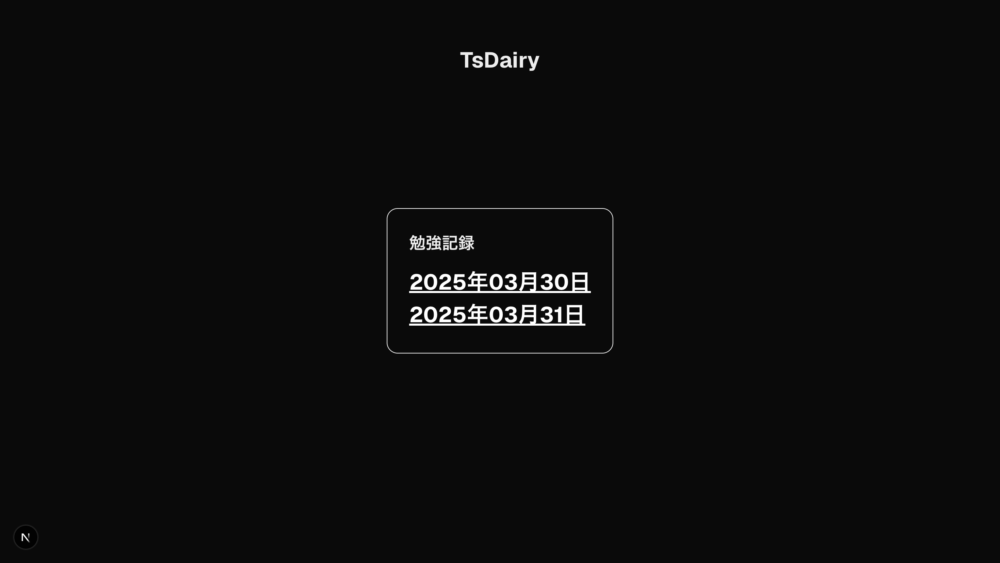

# TsDairy

## 概要

TsDairy は、日々の学習内容や振り返りを記録するための TypeScript ベースの日記アプリケーションです。Next.js を使用して構築されており、日付ごとのフォルダを自動生成し、学習の進捗を追跡することができます。
※UTC+9 対応



## 特徴

- 日付ごとのフォルダ自動生成
- TODO リスト管理
- シンプルで使いやすい UI
- TypeScript & Next.js による堅牢な実装

## 使い方

### 新しい日記の作成

```bash
npm run daily
```

このコマンドを実行すると、現在の日付のフォルダが `src/app/daily/YYYYMMDD` の形式で作成されます。同時に以下のファイルも自動生成されます：

- `page.tsx` - 日記ページのコンポーネント
- `page.module.css` - スタイル定義
- `README.md` - その日の学習内容や TODO を記録するファイル

### 日記の閲覧

アプリケーションを起動すると、トップページに日付一覧が表示されます。日付をクリックすると、その日の日記ページに移動します。

```bash
npm run dev
```

## プロジェクト構造

```
my-app/
├── src/
│   └── app/
│       ├── page.tsx        # トップページ
│       ├── page.module.css # トップページのスタイル
│       └── daily/          # 日記フォルダ
│           ├── 20250331/   # 日付フォルダ
│           │   ├── page.tsx
│           │   ├── page.module.css
│           │   └── README.md
│           └── ...
├── create-daily.mjs    # 日記フォルダ生成スクリプト
└── package.json
```

## 技術スタック

- **フレームワーク**: Next.js
- **言語**: TypeScript
- **スタイリング**: CSS Modules

## ライセンス

MIT

---

学習の記録を習慣化し、日々の進捗を可視化することで、より効果的な学習体験を提供します。TsDairy で学習の旅を記録しましょう！

---
